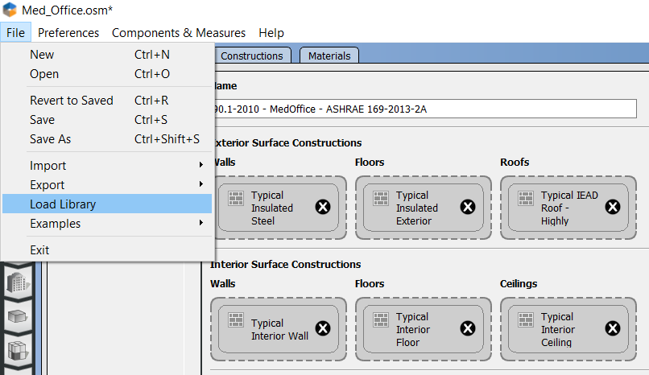

<h1>Installation and Introductory Tutorial</h1>
This page walks you through installing the OpenStudio Application, the basics of its suite of applications, and the fundamental workflow.

## Installation Instructions
OpenStudio Application is supported on 64-bit versions of Windows, OS X, and Ubuntu. OpenStudio Application is supported on 64-bit ARM versions of OS X. Each OpenStudio Application release supports the latest EnergyPlus release which is bundled with the OpenStudio Application installer. Check the [version compatibility-matrix](https://github.com/openstudiocoalition/OpenStudioApplication/wiki/OpenStudio-Application-Version-Compatibility-Matrix) for more details about each version.

###Installation Steps
__Download and install OpenStudio Application__

1. Download the latest release of OpenStudio Application [here](https://github.com/openstudiocoalition/OpenStudioApplication/releases).
2. Choose the installer that matches your operating system. The OpenStudio Application package contains the following components:
    - OpenStudio Application
    - EnergyPlus
    - Ruby API
    - C# API
    - Command Line Interface
    - Radiance
    - Application Resources

__Optional - Download and install SketchUp and the Openstudio SketchUp Plug-in [here](https://github.com/openstudiocoalition/openstudio-sketchup-plugin/releases)__

There are a few options for generating geometry for the OpenStudio Application, including the built-in FloorspaceJS interface. One option is to use the OpenStudio Sketchup Plug-in. To use the plug-in:

1. Download and install [SketchUp](https://www.sketchup.com/), only the Pro or Studio versions of SketchUp are compatible . Check the [version compatibility-matrix](
https://github.com/openstudiocoalition/openstudio-sketchup-plugin/wiki/OpenStudio-SketchUp-Plug-in-Wiki#openstudio-sketchup-plug-in-version-compatibility-matrix) to see which versions of SketchUp and the OpenStudio SketchUp Plug-in are compatible with the installed version of the OpenStudio Application.
2. Download the OpenStudio SketchUp Plug-in RBZ package [here](https://github.com/NREL/openstudio-sketchup-plugin/releases).
3. Follow the [Installing extensions manually in SketchUp Preferences](https://help.sketchup.com/en/extension-warehouse/adding-extensions-sketchup) to install the Plug-in.

__Optional - Setup a Building Component Library (BCL) Account__

[Building Component Library (BCL)](https://bcl.nrel.gov/) content can now be accessed from within the OpenStudio SketchUp Plug-in and from the standalone OpenStudio Application without a BCL key.

__Optional - Install Parametric Analysis Tool (PAT)__

1. Download the latest release of PAT [here](https://github.com/NREL/OpenStudio-PAT/releases) (not available for Linux).

## Workflow Overview
The typical OpenStudio Application workflow is shown in the diagram below.

*About: Click on the diagram above to view a larger version.*

Data Viewer is used to view simulation results. The section within documentation for Running Simulation & Viewing Results has information on using [Data Viewer](../getting_started/running_your_simulation.md#using-data-viewer).

The [Parametric Analysis Tool Interface Guide](http://nrel.github.io/OpenStudio-user-documentation/reference/parametric_analysis_tool_2/) provides an introduction to the interface and workflow for creating multiple design alternatives from a seed model.

## Introductory Tutorial
The tutorial below was created before the grid view was added to the Space Types and Thermal Zones tabs. Grid view allows you to view and edit more than one space type or thermal zone at a time. Go to the [OpenStudio Application Interface Guide](../reference/openstudio_application_interface.md) to learn more about grid view.

### Selecting a Library for Constructions, Loads, and Schedules

Libraries that are included with the OpenStudio Application contain data for constructions, loads, and schedules for 6 vintages across all U.S. climate zones. They also contain data for 9 vintages specific to DEER. The Libraries do not contain any geometry. Load libraries by using the menu under __File/Load Library__. Then select your vintage from the default file set. The Library data is organized such that you can access specific constructions and loads, or you can apply construction sets and space types that contain whole packages of subsequent dependent characteristics. For example a Library Space Type contains several specific loads and associated schedules for that space type, all of which become part of your model if you add the Space Type to your model. You can also load previously generated models as Libraries through the __File/Load Library__ menu by navigating to any OpenStudio Model file from the browser window that pops up. It can take a few minutes to load.

*Above: Load a new Library using the menu.*

It is good practice to regularly clear the Libraries that load when the OpenStudio Application opens by using the menu under __Preferences/Change Default Libraries__ and selecting __Restore Defaults__. If the OpenStudio Application is loading several Libraries it will slow down significantly.

Vintages:

- DOE reference (Pre-1980, 1980-2004)
- ASHRAE standard (189.1-2009, 90.1-2004, 90.1-2007, 90.1-2010, 90.1-2013)
- DEER (pre-1975, 1985, 1996, 2003, 2007, 2011, 2014, 2015, 2017)

Climate Zones: 1 - 8

### FloorspaceJS - Building Envelope

For additional information on the integrated FloorspaceJS interface, go to the [FloorspaceJS Interface Guide](../reference/geometry_editor.md)

### SketchUp Plug-in - Building Envelope
For additional information on the SketchUp Plug-in interface, go to the [OpenStudio SketchUp Plug-in Interface Guide](../reference/sketchup_plugin_interface.md).

<!--
## Introductory Tutorial
- Choosing a Template
- Modeling the Building Envelope
- Assigning Building Activity
- Assigning Thermal Zones
- Assign Thermostats
- Saving the OpenStudio Model from the SketchUp Plugin
- Moving from the Plugin to the OpenStudio Application
- Adding Weather and Design Day Files
- Adding a Mechanical System
- Running a Simulation
- Viewing Simulation Results
-->
