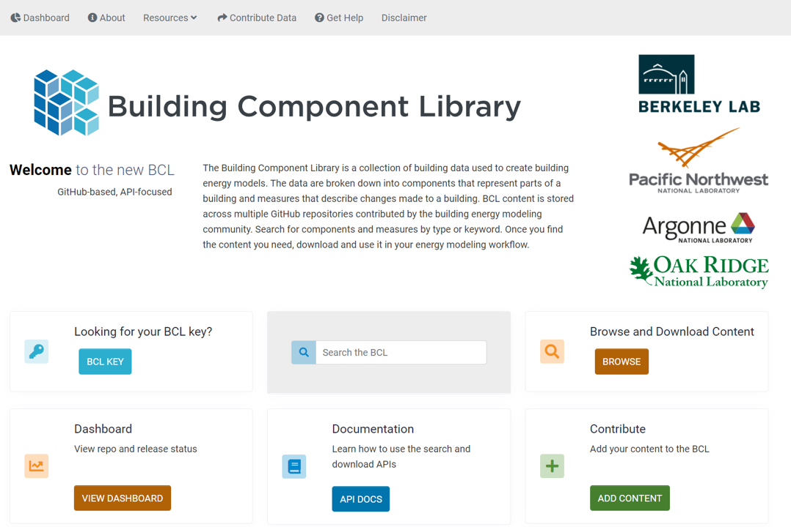

<h1>The Building Component Library</h1>

The [Building Component Library](https://bcl.nrel.gov/) is one of the most powerful and time saving features associated with OpenStudio. Users can simply drag and drop BCL retrofit measures into a model to create quick and replicable analysis.  
It is a collection of building data used to create building energy models. The data are broken down into components that represent parts of a building and measures that describe changes made to a building. BCL content is stored across multiple GitHub repositories contributed by the building energy modeling community. Search for components and measures by type or keyword. Once you find the content you need, download and use it in your energy modeling workflow.

